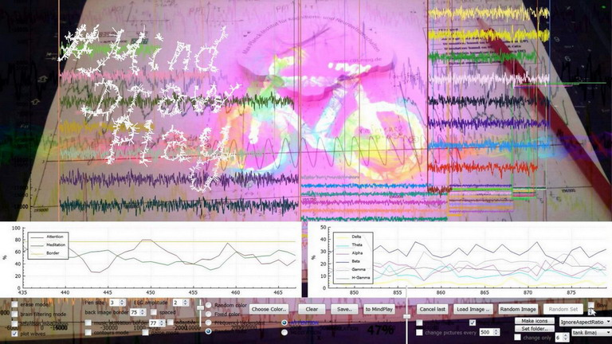
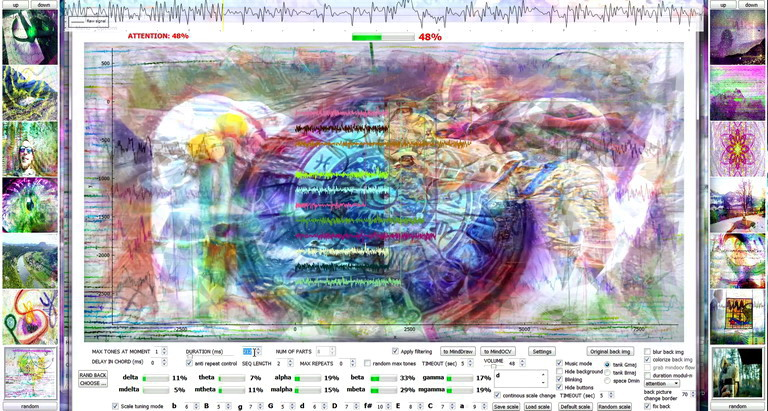

# minddrawplay

Code is written in C++ / Qt, the project is specifically made for mobile EEG devices MindWave NeuroSky / MyndPlay, 
but also can work with other EEG devices through BCI2000 module and can be adapted for other mobile or full EEG systems.

====

MindDrawPlay – is a project of experimental interactive audio-visual art, 
representing translation of brain waves to drawing, visual and musical spaces, flows and controls. 
It has been grown on a base of research work in the direction of Brain-Computer Interfaces. 
Combining technology advances – such as mobile EEG devices and musical knowledge – such as pentatonic scales, 
it allows everyone to see, to hear his brain activity represented by set of sounds 
and to use brain waves as a brush for drawing, as parameters for image filtering, 
attention modulated color-overlay pictures flows, in “puzzle gathering”, “find the same” 
and “go through” games. MindDrawPlay is much more than a neurofeedback app with sounds 
and visualizations, it provides with a unique experience of 
interactive immersion into flows of your mindspace.

The brain waves data (expressions of delta, theta, alpha, beta, gamma bands, attention and meditation levels)
can be streamed via OSC to any external application (see example of integration with TouchDesigner: osc_mdp.toe)

broader overview in "about.pdf" 

Example of running app: https://vimeo.com/396706503

https://www.artstation.com/neur0forest/albums/1425498

==== hardware requirements ====

- EEG device MindWave NeuroSky

http://neurosky.com

in case of a problem with the device connection via bluetooth, try to install driver manually:

http://download.neurosky.com/public/Products/MindWave%20headset/RF%20driver/RF%20driver.zip

- full-hd resolution of the screen is required for a proper usage of the application GUI

====  software requirements ====

OpenCV libraries (see .pro file)

==== third-party code / libraries licenses: ====

qcustomplot.h / qcustomplot.cpp codes by Emanuel Eichhammer, GNU General Public License v. 3.0

appconnect.h / appconnect.cpp codes by J. Adam Wilson, BCI2000, GNU General Public License v. 3.0

sockstream.h / sockstream.cpp codes by Juergen Mellinger, GNU General Public License v. 3.0

thinkgear.h / thinkgear.lib / thinkgear.dll from official MindWave NeuroSky SDK

https://store.neurosky.com/pages/license-agreement

Eigen library, Mozilla Public License v. 2.0

OSCpack, by Ross Bencina, MIT open source license
